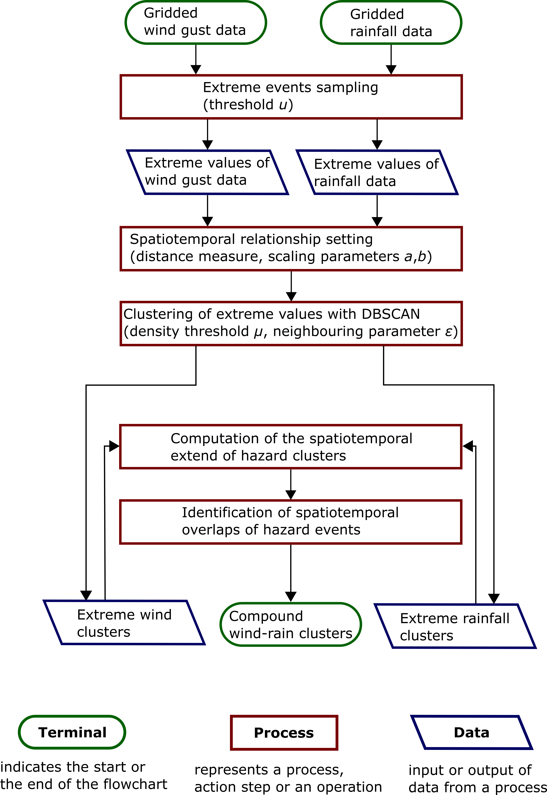
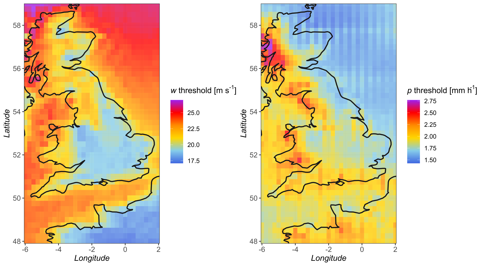
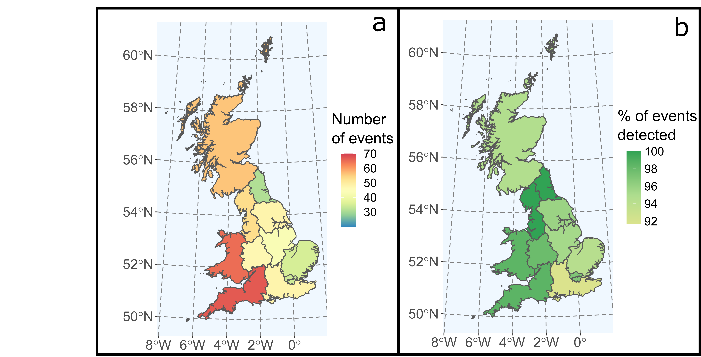

This methodology uses gridded data (here Climate reanalysis) and the
DBSCAN clustering algorithm to identify spatiotemporal clusters of
single and compound hazards

Data
====

The data used in this study is extracted from ERA5. ERA5 is a climate
reanalysis product which was released in 2019 by ECMWF and benefits from
the latest improvements in the field (Hersbach et al., 2020). ERA5 data
(ECMWF, 2020) is available 1979 to present (we use up to September
2019), with a spatial resolution of 0.25deg x 0.25deg and an hourly
temporal resolution. The data resolves the atmosphere using 137 levels
from the surface up to a height of 80 km (ECMWF, 2020). ERA5 data are
generated with a short forecast of 18 h twice a day (06:00 and 18:00
UTC) and assimilated with observed data (ECMWF, 2020). more information
about ERA5 can be found
[here](https://confluence.ecmwf.int/display/CKB/ERA5%3A+data+documentation).

The two following variables are extracted from the product:

-   Extreme precipitation (p): accumulated liquid and frozen water,
    comprising rain and snow, that falls to the Earth’s in one hour
    (mm). This value is averaged over a grid cell.

-   Extreme wind (w): hourly maximum wind gust at a height of 10 m above
    the surface of the Earth (m s-1). The WMO (2021) defines a wind gust
    as the maximum of the wind averaged over 3 s intervals. As this
    duration is shorter than a model time step, this value is deduced
    from other parameters such as surface stress, surface friction, wind
    shear and stability. This value is averaged over a grid cell.

Importation of the raw data
---------------------------

Input data is divided into 4 files for each variables representing 4
periods:

1.  1979-1986
2.  1987-1997
3.  1998-2008
4.  2009-2019

``` r
library(ncdf4)

filer=c(paste0(getwd(),"/data/in/raindat_7986.nc"),
        paste0(getwd(),"/data/in/raindat_8797.nc"),
        paste0(getwd(),"/data/in/raindat_9808.nc"),
        paste0(getwd(),"/data/in/raindat_0919.nc"))
filew=c(paste0(getwd(),"/data/in/windat_7986.nc"),
        paste0(getwd(),"/data/in/windat_8797.nc"),
        paste0(getwd(),"/data/in/windat_9808.nc"),
        paste0(getwd(),"/data/in/windat_0919.nc"))

Startdate=as.POSIXct("1979-01-01 10:00:00")
Enddate=as.POSIXct("1986-12-31 23:00:00")
# ncr = nc_open(filer)
# ncw = nc_open(filew)
```

Intermediary data
-----------------

Intermediary data are stored in the “data/interdat” folder which
contains the following files in Rdata format:

    ##  [1] "allraininclusters1.Rdata" "allraininclusters2.Rdata"
    ##  [3] "allraininclusters3.Rdata" "allraininclusters4.Rdata"
    ##  [5] "extremEventsWind.Rdata"   "interclustRain.Rdata"    
    ##  [7] "interclustWind.Rdata"     "metaclustRain.Rdata"     
    ##  [9] "metaclustWind.Rdata"      "Rain_99_AllP.Rdata"      
    ## [11] "rainP1.Rdata"             "rainP2.Rdata"            
    ## [13] "rainP3.Rdata"             "rainP4.Rdata"            
    ## [15] "rawclustRain.Rdata"       "rawclustWind.Rdata"      
    ## [17] "timeP1.Rdata"             "timeP2.Rdata"            
    ## [19] "timeP3.Rdata"             "timeP4.Rdata"            
    ## [21] "windP1.Rdata"             "windP2.Rdata"            
    ## [23] "windP3.Rdata"             "windP4.Rdata"            
    ## [25] "Wnd_99_AllP.Rdata"

-   allraininclustersX: \[data.frame\] files are used to assess more
    accurately the accumulated precipitation during events by collecting
    precipitations from timesteps in which precipitation is above and
    below the threshold for every grid cell and the whole duration of
    the cluster.

-   99\_allp: \[matrix\] value of extreme precipitation and extreme wind
    gust threshold over the whole domain (one value per grid cell)

-   interclust: \[list\] files contain a list of data from wind and
    precipitation clusters divided in the 4 periods aggregated over
    space and clusters (1 value per grid cell per cluster). These files
    are uses to create the files “RainEv\_ldat” and “Windev\_ldat”.

-   metaclust: \[list\] files contain a list of metadata from wind and
    precipitation clusters divided in the 4 periods . These files are
    uses to create the files “RainEv\_meta” and “Windev\_meta”.

-   rainPX: \[matrix\] files contain a 3D matrix of dimension
    long*lat*time containing precipitation data for the period X.

-   rawclust: \[list\] files contain a list of data.frame from wind and
    precipitation clusters divided in the 4 periods. These files are
    uses to create the files “RainEv\_hdat” and “Windev\_hdat”.

-   timePX: \[vector\] contain vectors of time for the 4 periods.

-   windPX: \[matrix\] files contain a 3D matrix of dimension
    long*lat*time containing wind gust data for the period X.

Output data
-----------

Output data contains metadata and raw data of single and compound hazard
clusters are stored in the “data/out” folder which contains the
following files in Rdata format:

    ##  [1] "compoundclusters.csv"         "CompoundRW_79-19.v3x.Rdata"  
    ##  [3] "extremEvents_Rain.Rdata"      "extremEvents_Wind.Rdata"     
    ##  [5] "Rain_stfprint.Rdata"          "rainclusters.csv"            
    ##  [7] "RainEv_hdat_1979-2019.Rdata"  "RainEv_ldat_1979-2019.Rdata" 
    ##  [9] "Rainev_ldatp_1979-2019.Rdata" "RainEv_meta_1979-2019.Rdata" 
    ## [11] "RainEv_metap_1979-2019.Rdata" "Wind_stfprint.Rdata"         
    ## [13] "windcluster.csv"              "WindEv_hdat_1979-2019.Rdata" 
    ## [15] "WindEv_ldat_1979-2019.Rdata"  "WindEv_meta_1979-2019.Rdata"

-   CompoundRW: \[data.frame\] contains metadata for the compound hazard
    clusters identified

-   \_hdat: \[data.frame\] hourly data of precipitation and wind gust
    clusters.

-   \_ldat: \[data.frame\] aggregated data over space and clusters (1
    value per grid cell per cluster) for wind gust and precipitation
    clusters.Rain\_ldatp contains aggregated values including
    non-extreme timesteps. Created from allraininclustersX.

-   \_meta:\[data.frame\] metadata for wind gust and precipitation
    clusters

-   stfprint: \[data.frame\] files containing duration\*footprint of
    each hazard clusters during all clusters

-   sptdf: \[data.frame\] data.frame containing spatial, temporal,
    cluster and intensity information

Methodology
===========

The methodology is summarized in the folowing chart (Figure 1):

<figure>
<figcaption>Flowchart of the methodology developed, Spatiotemporal Identification of Compound Hazards (SI-CH), for wind and precipitation data in Great Britain</figcaption>
</figure>

The main steps of the methodology are the following:

-   Variable data extraction with thresholds. Values of both variables
    (extreme wind, extreme precipitation) are extracted (Figure 2). A
    threshold approach with a threshold u is used to sample extreme
    values. This is done in the file “01\_Preprocess\_Clustering.R”.

<figure>
<figcaption>Threshold values for wind gust and precipitation</figcaption>
</figure>

-   Single hazard spatiotemporal clusters. The different parameters
    required for the clustering are set. Extreme values are clustered in
    space and time with a clustering algorithm (DBSCAN), creating two
    sets of clusters: (i) extreme wind and (ii) extreme precipitation.
    This is done in the file “01\_Preprocess\_Clustering.R”.
    Intermediary data and outputs are saved in the data folder.

-   Compounds hazard spatiotemporal clusters. Extreme wind and extreme
    precipitation clusters are paired according to their spatiotemporal
    overlaps. This is done in the file
    “02\_Compound\_Cluster\_Creation.R”.

``` r
#load files containing all occurrences of hazard clusters during all clusters
#wind
load(file=paste0(getwd(),"/data/out/Wind_stfprint.Rdata"))

#precipitation
load(file=paste0(getwd(),"/data/out/Rain_stfprint.Rdata"))

#Inner join in R:  Return only the rows in which
#the left table have matching keys in the right table

#Identifies clusters which have temporal overlap
library(dplyr)
#sp03<-inner_join(nwo3,nvo3,by=c("loc","dd"))
```

Results
=======

Plots and figures
-----------------

Outputs and different scripts to analyse of single and compound hazard
clusters are availaible in the file “03\_Compound\_Analysis.R”. The
following analysis can be achieved:

1.  Boxplots of spatial and temporal scales of compound hazard clusters

2.  Plots of single and compound hazard clusters of different sizes
    (maps)

3.  Identification of hotspots for compound hazards (maps)

4.  Seasonal analysis of single and compound hazard clusters

5.  Quantile-space plots showing the relationship between intensity and
    footprints of events

6.  Spatial dependence plots for compound hazards (maps)

Databases
---------

Three databases in a .csv format are created as output of the method:

1.  Extreme precipitation clusters

2.  Extreme wind clusters

3.  Compound hazard clusters

With the following attributes:

    ##  [1] "comb_ID"                    "combin"                    
    ##  [3] "rain_ID"                    "wind_ID"                   
    ##  [5] "startime"                   "endtime"                   
    ##  [7] "startime.Rain"              "endtime.Rain"              
    ##  [9] "startime.Wind"              "endtime.Wind"              
    ## [11] "rain.footprint..cells."     "rain.duration..h."         
    ## [13] "rain.max.co..mm."           "rain.mean.co..mm."         
    ## [15] "rain.max..mm."              "wind.footprint..cells."    
    ## [17] "wind.duration..h."          "wg.max.co..m.s.1."         
    ## [19] "wg.mean.co..m.s.1."         "wg.max..m.s.1."            
    ## [21] "comp.duration.OR..h."       "comp.footprint.AND..cells."
    ## [23] "comp.duration.AND..h."      "comp.footprint.OR..cells."

Confrontation with significant extreme events
---------------------------------------------

Results of the SI-CH method over Great Britain are compared to a set of
157 significant extreme events (96 extreme precipitation and 61 extreme
wind events) that occurred in Great Britain over the period 1979-2019.
The comparison is done using a hit rate (ratio between the number of
joint events and the total number of events). We find a good agreement
between SI-CH outputs and the set of significant events (Hit rate =
93.6%). This confrontation is done in the fine
“04\_Validation\_clusters.R”.

<figure>
<figcaption>Distribution of significant events per NUTS1 regions (a) and hit rate per NUTS1 regions (b)</figcaption>
</figure>

Sensitivity analysis
--------------------

A sensitivity analysis of the main parameters of the SI-CH methodology
is conducted in “05\_Sensitivity\_Analysis.R”. The Sensitivity analysis
is performed over one year of reanalysis data (2016) with the SRC
(standardized regression coefficient). The SRC is a sensitivity index to
assess the importance of each input parameter. For compound hazard
cluster, the most dominant variable is the threshold for the sampling of
extreme events.
